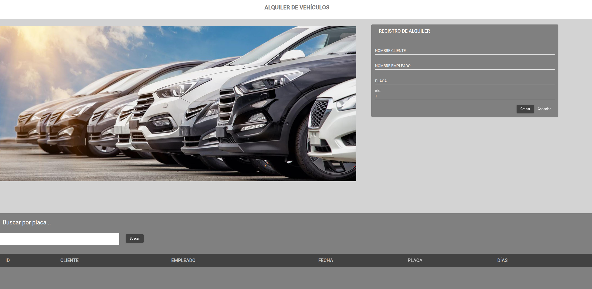

<div align="center">

# 🚗 Sistema de Gestión de Alquiler de Vehículos


Aplicación web moderna desarrollada con Angular para la gestión integral de alquileres de vehículos de una empresa. Sistema completo CRUD con interfaz intuitiva y diseño responsivo.

[Características](#-características) • [Tecnologías](#-tecnologías) • [Instalación](#-instalación) • [Uso](#-uso) • [Estructura](#-estructura-del-proyecto)

</div>

---

## 📋 Descripción

Sistema de gestión de alquiler de vehículos que permite a las empresas administrar de manera eficiente el registro, consulta, actualización y eliminación de alquileres. La aplicación cuenta con una interfaz moderna construida con Angular Material, proporcionando una experiencia de usuario fluida y profesional.

### ✨ Características

- ✅ **CRUD Completo**: Crear, leer, actualizar y eliminar registros de alquileres
- 🔍 **Búsqueda en Tiempo Real**: Filtrado por placa de vehículo
- 📊 **Tabla Dinámica**: Visualización organizada de todos los alquileres
- 🎨 **Interfaz Moderna**: Diseño responsivo con Angular Material
- 📝 **Formularios Modales**: Edición y creación mediante diálogos
- 🔄 **Actualización Automática**: Sincronización en tiempo real con el backend
- 🎯 **Arquitectura Modular**: Código organizado y mantenible

## 🛠️ Tecnologías

### Frontend
- **Angular 14.2.0** - Framework principal
- **TypeScript 4.7.2** - Lenguaje de programación
- **Angular Material 13.0.0** - Componentes UI
- **RxJS 7.5.0** - Programación reactiva
- **Angular Flex Layout** - Sistema de layout responsivo
- **Angular CDK** - Componentes de desarrollo

### Herramientas de Desarrollo
- **Angular CLI 14.2.6** - Herramientas de línea de comandos
- **Karma & Jasmine** - Framework de testing
- **TypeScript Compiler** - Compilación y transpilación

## 🚀 Instalación

### Prerrequisitos

Asegúrate de tener instalado en tu sistema:

- **Node.js** (versión 14 o superior)
- **npm** (incluido con Node.js)
- **Angular CLI** (se instala con las dependencias)

### Pasos de Instalación

1. **Clonar el repositorio**
   ```bash
   git clone https://github.com/YadiraAllauca/AlquilerDeVehiculosApp.git
   cd AlquilerDeVehiculosApp
   ```

2. **Instalar dependencias**
   ```bash
   npm install
   ```

3. **Configurar el backend**
   
   Este proyecto requiere el backend correspondiente para funcionar correctamente. Asegúrate de tener el [Backend de Alquiler de Vehículos](https://github.com/YadiraAllauca/BackendAlquilerDeVehiculos) configurado y ejecutándose.

4. **Iniciar el servidor de desarrollo**
   ```bash
   npm start
   ```

   La aplicación estará disponible en `http://localhost:4200`

## 💻 Uso

### Funcionalidades Principales

#### 📝 Registrar Nuevo Alquiler
- Accede al formulario de registro desde la interfaz principal
- Completa los campos requeridos: cliente, empleado, placa y días
- El sistema genera automáticamente la fecha de registro

#### 📋 Visualizar Alquileres
- La tabla muestra todos los alquileres registrados
- Información visible: ID, Cliente, Empleado, Fecha, Placa y Días

#### 🔍 Buscar Alquileres
- Utiliza el campo de búsqueda para filtrar por placa de vehículo
- La búsqueda se realiza en tiempo real

#### ✏️ Editar Alquiler
- Selecciona un registro de la tabla
- Modifica los datos necesarios en el formulario modal
- Guarda los cambios

#### 🗑️ Eliminar Alquiler
- Elimina registros que ya no sean necesarios
- Confirmación automática de eliminación

### Captura de Pantalla



## 📁 Estructura del Proyecto

```
AlquilerDeVehiculosAppWeb/
├── src/
│   ├── app/
│   │   ├── alquiler/
│   │   │   ├── components/
│   │   │   │   ├── form/              # Componente de formulario de creación
│   │   │   │   ├── form-update/       # Componente de formulario de actualización
│   │   │   │   ├── table/             # Componente de tabla principal
│   │   │   │   └── tabla-vista/       # Componente de vista de tabla
│   │   │   ├── interfaces/
│   │   │   │   └── metacolumn.interface.ts
│   │   │   ├── models/
│   │   │   │   └── alquiler.ts        # Modelo de datos
│   │   │   ├── services/
│   │   │   │   └── alquilar.service.ts # Servicio HTTP
│   │   │   └── alquiler.module.ts
│   │   ├── app.component.*
│   │   └── app.module.ts
│   ├── assets/
│   ├── environments/
│   └── index.html
├── angular.json
├── package.json
├── proxy.conf.json
└── README.md
```

### Componentes Principales

- **TableComponent**: Gestiona la visualización y operaciones CRUD de la tabla
- **FormComponent**: Maneja la creación de nuevos alquileres
- **FormUpdateComponent**: Gestiona la actualización de alquileres existentes
- **AlquilarService**: Servicio que maneja todas las peticiones HTTP al backend

## 🔧 Configuración

### Proxy Configuration

El proyecto utiliza un archivo `proxy.conf.json` para redirigir las peticiones API durante el desarrollo. Asegúrate de configurarlo correctamente según tu entorno de backend.

### Variables de Entorno

Configura las variables de entorno en:
- `src/environments/environment.ts` (desarrollo)
- `src/environments/environment.prod.ts` (producción)

## 🧪 Testing

Para ejecutar las pruebas unitarias:

```bash
npm test
```

## 🤝 Contribución

Las contribuciones son bienvenidas. Para contribuir al proyecto:

1. **Fork** el repositorio
2. Crea una rama para tu feature (`git checkout -b feature/nueva-funcionalidad`)
3. Realiza tus cambios y **commit** (`git commit -m 'Agrega nueva funcionalidad'`)
4. **Push** a la rama (`git push origin feature/nueva-funcionalidad`)
5. Abre un **Pull Request**


## 📄 Licencia

Este es un proyecto académico. Todos los derechos de autor pertenecen al propietario del repositorio. 

## 👤 Autor

**Yadira Allauca**

- 📧 Email: yadiraallaucac@gmail.com
- 🔗 Backend: [BackendAlquilerDeVehiculos](https://github.com/YadiraAllauca/BackendAlquilerDeVehiculos)


